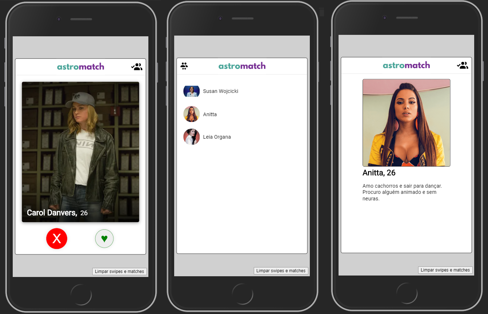

# AstroMatch

## Stack
* React.js
* Redux
* Axios
* Material-UI
* Styled-components

## Running the project 
* Clone this repository into your machine
* Open your terminal inside the cloned repo and run `npm install` and `npm run start`

## API
This project is originally integrated with Labenu's API: 

 https://us-central1-missao-newton.cloudfunctions.net/astroMatch/mateus
  
In order to run the integrated version of the app, you need to comment the **Offline section** of the code at `src/actions/profiles.js`
and uncomment the **Integrated section**.
